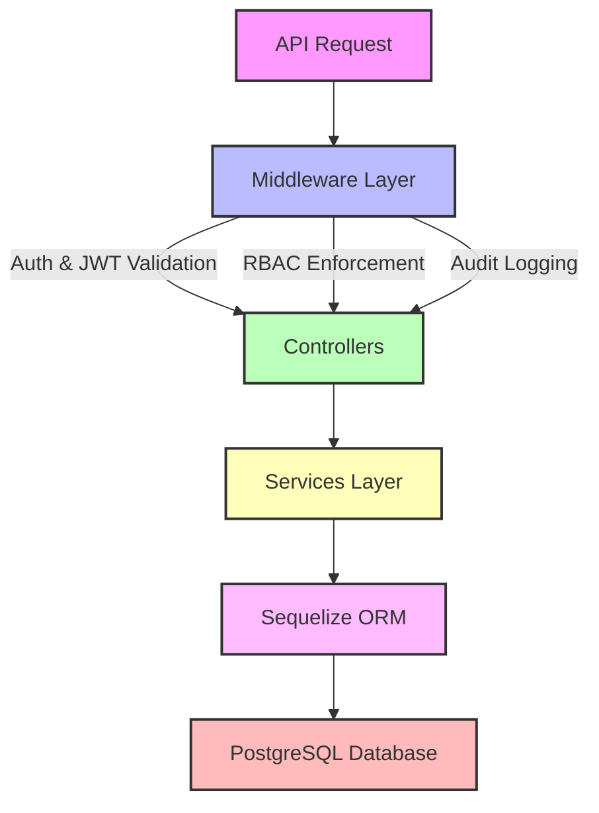

---

# EMR-Suite Backend Demo

   

**Electronic Medical Records (EMR) Suite – Backend Demo**

> ⚠️ **Note for recruiters:** This repository is a **demo** to showcase the backend sophistication of the **wiCare EMR** system. Production-grade simulation in a controlled environment to protect IP. Frontend development in progress.

---

## 🌟 Key Features

* **User & Role Management** – CRUD for users, roles, and permissions.
* **Authentication & Security** – JWT-based access & refresh tokens, password hashing, token revocation.
* **RBAC Enforcement** – Dynamic permissions and centralized middleware.
* **Audit Logging** – Tracks all sensitive actions (`CREATE`, `UPDATE`, `DELETE`, `LOGIN`, `LOGOUT`).
* **Database & ORM** – PostgreSQL + Sequelize with relations, migrations, and seeds.
* **Testing** – Full integration and RBAC tests using Jest + Supertest.
* **Docker Ready** – Backend and DB via Docker Compose.
* **Metrics Ready** – Prometheus integration supported.

---

## 🏗️ Project Structure

```
emr-suite-backend/
├─ src/
│  ├─ config/               # Configuration files for env, JWT, DB
│  │   ├─ config.js
│  │   └─ db.js
│  ├─ controllers/          # Request handlers
│  ├─ models/               # Sequelize models
│  ├─ services/             # Business logic
│  ├─ middlewares/          # Auth, RBAC, audit
│  ├─ routes/               # API endpoints
│  ├─ validation/           # Input validation schemas
│  ├─ seed/                 # Seed scripts for roles, users, permissions
│  │   └─ seed.js
│  ├─ test/                 # Jest + Supertest integration tests
│  ├─ app.js                # Express app
│  └─ server.js             # App bootstrap
├─ docker/                  # Dockerfiles & docker-compose.yml
├─ .env.dev                 # Development environment variables
├─ .env.prod                # Production environment variables
├─ package.json
└─ README.md
```

---

## 🧭 Conventions & Best Practices

* **camelCase** for all API response keys.
* **RBAC Enforcement** via middleware for protected routes.
* **Audit Logging** for create, update, delete, login, logout actions.
* **JWT Handling** – short-lived access, revocable refresh tokens, SHA-256 hashed in DB.
* **Error Handling** – standardized with `statusCode` and `message`.
* **Database Relations** – Sequelize models with clear associations.
* **Testing** – Jest + Supertest cover all critical flows.
* **PM2 Support** – Dev and prod processes managed for reliability and scaling.

---

## 🖼️ Architecture Diagram



---

## 🚀 Installation & Local Development

### Prerequisites

* Node.js >= 20
* PostgreSQL >= 15
* npm >= 9

### Steps

```bash
git clone https://github.com/olubusade/emr-suite-backend.git
cd emr-suite-backend
npm install
```

### Environment Variables

Copy `.env.dev` for local development:

```bash
cp .env.dev .env
```

Sample `.env.dev`:

```env
ENV=dev
NODE_ENV=development
PORT=5000
DB_HOST=localhost
DB_PORT=5432
DB_USER=postgres
DB_PASS=postgres
DB_NAME=busade_emr_demo_db
CORS_ORIGIN=http://localhost:4200
JWT_SECRET=your_jwt_secret
JWT_REFRESH_SECRET=your_jwt_refresh_secret
ACCESS_TTL=15m
REFRESH_TTL=7d
JWT_ISSUER=http://localhost:5000
```

---

### Seed Initial Data

```bash
npm run seed
```

---

### Run Development Server

```bash
npm run dev
```

> Runs server at `http://localhost:5000` with hot reload.

---

---

## 🐳 Docker Setup

```bash
cd docker
docker compose up --build
```

* Backend: `http://localhost:5000`
* PostgreSQL: `localhost:5432`

Stop containers:

```bash
docker compose down
```

---

## 🔐 Authentication & RBAC

* **Login:** `POST /api/auth/login` → Returns access & refresh tokens
* **Refresh token:** `POST /api/auth/refresh`
* **Change password:** `POST /api/auth/change-password`

Roles: `super_admin`, `admin`, `doctor`, `nurse`, `reception`, `billing`, `lab`, `pharmacy`

Middleware enforces permissions dynamically.

---

## 🧪 Testing

Run all tests:

```bash
npm run test
```

RBAC-specific tests:

```bash
npm run test:rbac
```

Watch mode:

```bash
npm run test:watch
```

---

## 💾 Database

* PostgreSQL with Sequelize ORM
* Tables: `Users`, `Roles`, `Permissions`, `RefreshTokens`, `Patients`, `Appointments`, `Bills`, `AuditLogs`, `Metrics`

Seed scripts at `src/seed/seed.js`:

```javascript
import { Role, Permission, User } from '../models/index.js';
import { hash } from '../utils/passwords.js';

async function seed() {
  const roles = await Role.bulkCreate([
    { name: 'super_admin' },
    { name: 'admin' },
    { name: 'doctor' },
    { name: 'nurse' },
  ]);

  const perms = await Permission.bulkCreate([
    { name: 'CREATE_PATIENT' },
    { name: 'UPDATE_PATIENT' },
    { name: 'DELETE_PATIENT' },
    { name: 'VIEW_PATIENT' },
  ]);

  const passwordHash = await hash('admin@123');
  await User.create({ email: 'admin@busade-emr-demo.com', name: 'Admin User', passwordHash });
  console.log('Database seeded successfully.');
}

seed();
```

---

## ⚙️ NPM Scripts

| Script                | Description                            |
| --------------------- | -------------------------------------- |
| `npm run dev`         | Start backend in development mode      |
| `npm start`           | Start backend in production mode       |
| `npm run seed`        | Seed initial roles, users, permissions |
| `npm run test`        | Run all tests                          |
| `npm run test:watch`  | Watch mode for tests                   |
| `npm run test:rbac`   | Run RBAC module-specific tests         |
| `npm run docker:dev`  | Start dev environment via Docker       |
| `npm run docker:prod` | Start prod environment via Docker      |
| `npm run down`        | Stop all Docker containers             |

---

## 🌐 API Documentation

* **Swagger UI:** `/api-docs` – Interactive exploration of all endpoints.

---

## ⚡ CI/CD (GitHub Actions)

Example `.github/workflows/ci.yml`:

```yaml
name: CI

on:
  push:
    branches: [main]
  pull_request:
    branches: [main]

jobs:
  build-and-test:
    runs-on: ubuntu-latest

    services:
      postgres:
        image: postgres:15
        env:
          POSTGRES_USER: postgres
          POSTGRES_PASSWORD: postgres
          POSTGRES_DB: emr_suite
        ports:
          - 5432:5432
        options: >-
          --health-cmd pg_isready
          --health-interval 10s
          --health-timeout 5s
          --health-retries 5

    steps:
      - uses: actions/checkout@v3
      - name: Set up Node.js
        uses: actions/setup-node@v3
        with:
          node-version: 20
      - run: npm install
      - run: npm run seed
      - run: npm test
```

> Installs dependencies, seeds DB, and runs tests on every push/PR to `main`.

---

📜 License

MIT License © 2025 Busade Adedayo

---
