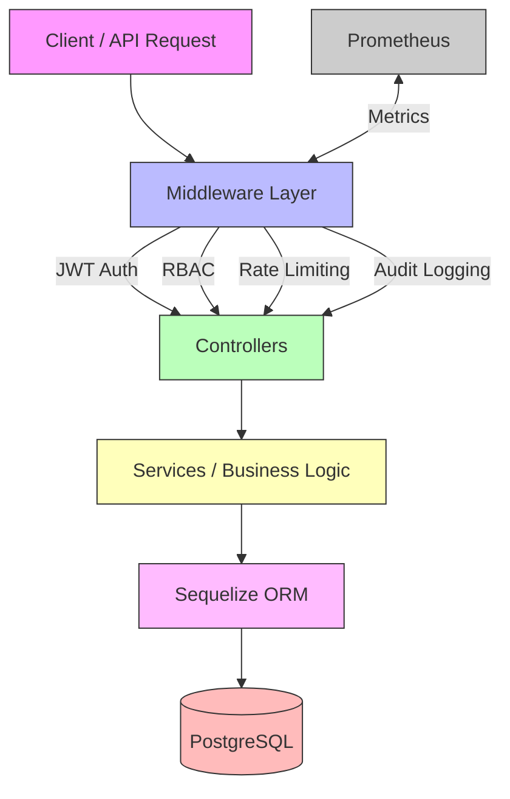

# EMR-Suite Backend Demo

    

**Electronic Medical Records (EMR) Suite – Backend Demo**

> ⚠️ **Note for recruiters:** This repository is a **demo** showcasing production-grade backend design of the **wiCare EMR** system.
> It includes **authentication, RBAC, audit logging, Swagger docs, metrics, and modular APIs**.
> Frontend integration (Angular/Ionic) is ongoing.

---

## 🌟 Key Features

* **Authentication & Security**

  * JWT access + refresh tokens
  * Token revocation
  * Rate limiting (global + per-endpoint)
  * Helmet + CORS + morgan logging
* **RBAC (Role-Based Access Control)**

  * Roles: `super_admin`, `admin`, `doctor`, `nurse`, `receptionist`, `patient` (extensible)
  * Permissions mapped to modules (`patient:read`, `clinical:create`, etc.)
  * User–Role & Role–Permission many-to-many associations
  * Centralized authorization middleware
* **Modules / APIs**

  * **Users & Roles** → CRUD, login, password change
  * **Patients** → CRUD
  * **Appointments** → CRUD
  * **Bills** → CRUD
  * **Clinical Notes** → Create, list, update, delete
  * **Vitals** → Record, update, delete
* **Audit Logging**

  * Logs CREATE / UPDATE / DELETE + LOGIN / LOGOUT
  * Audit entries include `actorId`, `action`, `entity`, `before`, `after`
* **Developer Experience**

  * Swagger (`/api-docs`) with RBAC annotations
  * Sequelize migrations + seeds
  * Jest + Supertest integration tests
  * Docker & Docker Compose (dev + prod ready)
  * Prometheus metrics (`/metrics`) for observability
* **Recruiter-Friendly**

  * Clear architecture
  * Scalable, modular design
  * CI/CD via GitHub Actions

---

## 🏗️ Project Structure

```
emr-suite-backend/
├─ src/
│  ├─ config/               # env, JWT, Swagger, DB config
│  ├─ controllers/          # request handlers
│  ├─ middlewares/          # auth, RBAC, audit, rateLimit, metrics
│  ├─ models/               # Sequelize models (User, Role, Permission, Audit, etc.)
│  ├─ routes/               # API routes (users, patients, clinical, vitals, etc.)
│  ├─ seed/                 # role/user/permission seeds
│  ├─ validation/           # Joi/Yup schemas for request validation
│  ├─ utils/                # validation helpers, logger
│  ├─ app.js                # Express app setup
│  └─ server.js             # App entry point
├─ docker/
│  ├─ Dockerfile
│  ├─ docker-compose.dev.yml
│  ├─ docker-compose.prod.yml
├─ tests/                   # Jest + Supertest suites
├─ .env.dev                 # local dev env
├─ .env.prod                # local prod env
├─ jest.config.js
├─ package.json
└─ README.md
```

---

## 🖼️ Architecture Diagram



---

## 🔐 Authentication & RBAC

* **Login:** `POST /api/auth/login` → returns access + refresh tokens
* **Refresh token:** `POST /api/auth/refresh`
* **Logout:** `POST /api/auth/logout`
* **Change password:** `POST /api/auth/change-password`

### Roles & Permissions

* `super_admin` → all permissions
* `admin` → patient + appointment management
* `doctor` → clinical notes + vitals
* `nurse` → vitals + patient info
* `receptionist` → appointments + patient registration
* `patient` → own records only

Middleware:

* `authRequired` → checks JWT
* `authorize(PERMISSION)` → checks if user has permission

Example (Clinical Notes):

```js
router.post(
  '/',
  authRequired,
  authorize(PERMISSIONS.CLINICAL_CREATE),
  validate(createClinicalNoteSchema),
  clinicalController.createClinicalNote
);
```

---

## 🌐 API Docs

* **Swagger UI:** [http://localhost:5000/api-docs](http://localhost:5000/api-docs)
  Includes schemas, request/response examples, and RBAC notes.

---

## 🧪 Testing

```bash
npm test          # run all tests
npm run test:watch
npm run test:rbac # RBAC-focused tests
```

---

## 🚀 Local Development (no Docker)

### Prerequisites

* Node.js ≥ 20
* PostgreSQL ≥ 15
* npm ≥ 9

### Setup

```bash
git clone https://github.com/olubusade/emr-suite-backend.git
cd emr-suite-backend
npm install
cp .env.dev .env
npm run migrate
npm run seed
npm run dev
```

Local server: `http://localhost:5000`

---

## 🐳 Docker (Recommended)

```bash
npm run docker:up:dev      # start backend (5000) + Postgres (5432)
npm run docker:seed:dev    # seed roles/users/permissions
npm run docker:down:dev    # stop containers
```

> **Troubleshooting:**
> If port 5432 is busy, edit `docker-compose.dev.yml` → map `5433:5432`.

---

## ⚡ CI/CD (GitHub Actions)

* Runs on **push & PR to `main`**
* Steps:

  1. Spin up Postgres service
  2. Run migrations + seeds
  3. Run Jest test suite
* Ensures every commit has a **working backend**.

---

## 📊 Metrics & Monitoring

* **Prometheus endpoint:** `/metrics`
* Collects:

  * Request count & duration
  * Error rates
  * Route-level stats
* Ready to integrate with **Grafana dashboards**

---

## 📜 License

MIT License © 2025 Busade Adedayo

