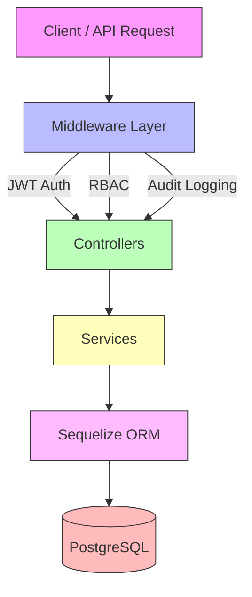

# EMR-Suite Backend Demo

   

**Electronic Medical Records (EMR) Suite – Backend Demo**

> ⚠️ **Note for recruiters:** This repository is a **demo** to showcase the backend sophistication of the **wiCare EMR** system. It simulates production-grade behavior in a controlled environment to protect IP. Frontend work is in progress.

---

## 🌟 Key Features

* **User & Role Management** – CRUD for users, roles, and permissions
* **Authentication & Security** – JWT access/refresh, password hashing, token revocation
* **RBAC Enforcement** – Centralized permission middleware
* **Audit Logging** – CREATE / UPDATE / DELETE / LOGIN / LOGOUT
* **Database & ORM** – PostgreSQL + Sequelize (migrations & seeds)
* **Testing** – Jest + Supertest integration and RBAC tests
* **Docker Ready** – One-command spin up for backend + Postgres
* **Metrics Ready** – Prometheus-friendly

---

## 🏗️ Project Structure

```
emr-suite-backend/
├─ src/
│  ├─ config/               # env, JWT, DB config
│  ├─ controllers/          # request handlers
│  ├─ middlewares/          # auth, RBAC, audit
│  ├─ models/               # Sequelize models
│  ├─ routes/               # API endpoints
│  ├─ seed/                 # seeds (roles/users/permissions)
│  ├─ validation/           # input schemas
│  ├─ db.js 
|  ├─ app.js
│  └─ server.js
├─ docker/
│  ├─ Dockerfile
│  ├─ docker-compose.dev.yml
│  ├─ docker-compose.prod.yml
|
├─ .env.dev                 # Local dev (DB_HOST=localhost, PORT=5000)
├─ .env.prod                # Local prod-like (optional)
├─ jest.config.js
├─ package.json
└─ README.md
```

---

## 🧭 Conventions & Best Practices

* **camelCase** API responses
* **RBAC** via middleware for protected routes
* **Audit logs** for critical actions
* **JWT** short-lived access + revocable refresh
* **Sequelize associations** reflect domain relations
* **Standard error shape** (`statusCode`, `message`)
* **Comprehensive tests** (auth, RBAC, business logic)

---

## 🖼️ Architecture Diagram



---

## 🚀 Local Development (no Docker)

### Prerequisites

* Node.js ≥ 20
* PostgreSQL ≥ 15
* npm ≥ 9

### Setup

```bash
git clone https://github.com/olubusade/emr-suite-backend.git
cd emr-suite-backend
npm install
```

Create `.env` from the provided template:

```bash
cp .env.dev .env
```

**`.env.dev` (local dev)**

```env
ENV=dev
NODE_ENV=development
PORT=5000

DB_HOST=localhost
DB_PORT=5432
DB_USER=postgres
DB_PASS=postgres
DB_NAME=busade_emr_demo_db

CORS_ORIGIN=http://localhost:4200

JWT_SECRET=your_jwt_secret
JWT_REFRESH_SECRET=your_jwt_refresh_secret
ACCESS_TTL=15m
REFRESH_TTL=7d
JWT_ISSUER=http://localhost:5000
```

Run migrations & seed:

```bash
npm run migrate
npm run seed
```

Start:

```bash
npm run dev
```

> Local server: `http://localhost:5000`

---

## 🐳 Docker (recommended for recruiters)

### 0) Quick start (TL;DR)

```bash
# from project root
npm run docker:up:dev      # build & start backend (port 5000) + Postgres (5432)
npm run docker:seed:dev    # seed roles/users/permissions
# open http://localhost:5000
```

### 1) Docker permissions (so you don’t need sudo)

If you see:

```
permission denied while trying to connect to the Docker daemon socket
```

Fix once:

```bash
sudo usermod -aG docker $USER
newgrp docker   # or log out & back in
```

### 2) Postgres port conflicts (5432 already in use?)

* **Option A (stop local Postgres):**

  ```bash
  sudo systemctl stop postgresql
  ```
* **Option B (use a custom host port for Docker):**
  Edit `docker/docker-compose.dev.yml` to map `5433:5432`:

  ```yaml
  services:
    db:
      image: postgres:15-alpine
      ports:
        - "5433:5432"
  ```

  Then set Docker env file `docker/env.dev`:

  ```env
  DB_PORT=5433
  ```

### 3) Environment files used by Docker

Docker uses its **own** env files in `docker/` to avoid clashing with your host:

* `docker/env.dev` (for `docker-compose.dev.yml`)
* `docker/env.prod` (for `docker-compose.prod.yml`)

**`docker/env.dev` (Docker dev)**

```env
ENV=dev
NODE_ENV=development
PORT=5000

DB_HOST=db
DB_PORT=5432
DB_USER=postgres
DB_PASS=postgres
DB_NAME=busade_emr_demo_db

CORS_ORIGIN=http://localhost:4200

JWT_SECRET=your_jwt_secret
JWT_REFRESH_SECRET=your_jwt_refresh_secret
ACCESS_TTL=15m
REFRESH_TTL=7d
JWT_ISSUER=http://localhost:5000
```

> Note the differences from local: `PORT=5000`, `DB_HOST=db`.

### 4) Start Docker (dev)

```bash
npm run docker:up:dev
```

* Backend: `http://localhost:5000`
* Postgres: `localhost:5432` (or `5433` if you changed it)

### 5) Seed inside Docker

```bash
npm run docker:seed:dev
```

### 6) View logs / stop

```bash
docker logs -f busade-emr-backend-dev
npm run docker:down:dev
```

---

## 🔐 Authentication & RBAC

* **Login:** `POST /api/auth/login` (returns access + refresh)
* **Refresh:** `POST /api/auth/refresh`
* **Change password:** `POST /api/auth/change-password`

Roles: `super_admin`, `admin`, `doctor`, `nurse`, `reception`, `billing`, `lab`, `pharmacy`.

---

## 🌐 API Docs

* **Swagger UI:** `/api-docs`

---

## 🧪 Testing

```bash
npm test
npm run test:watch
npm run test:rbac
```

---

## ⚙️ NPM Scripts

| Script             | What it does                                         |
| ------------------ | ---------------------------------------------------- |
| `local`            | Local dev for docker
| `dev`              | Local dev (nodemon) on port **5000**                 |
| `start`            | Local prod-like                                      |
| `migrate`          | Run Sequelize migrations 
| `migrate:undo`     | Stop Sequelize migration                             |
| `migrate:undo:all` | Stop all Sequelize migrations                             |
| `seed`             | Seed roles/users/permissions                         |
| `docker:up:dev`    | Build & start Docker (backend **5000**, db **5432**) |
| `docker:seed:dev`  | Run seed inside Docker                               |
| `docker:down:dev`  | Stop Docker dev stack                                |
| `docker:up:prod`   | Build & start Docker prod                            |
| `docker:seed:prod` | Seed inside Docker prod                              |
| `docker:down:prod` | Stop Docker prod stack
| `docker:logs:dev`  | Log Docker & log  |
| `docker:restart:log` | Restart Docker   |
| `test`             | Run all tests                                        |
| `test:watch`       | Jest watch mode                                      |
| `test:rbac`        | RBAC suite                                           |

---

## ⚡ CI/CD (GitHub Actions)

```yaml
name: CI

on:
  push:
    branches: [main]
  pull_request:
    branches: [main]

jobs:
  build-and-test:
    runs-on: ubuntu-latest

    services:
      postgres:
        image: postgres:15-alpine
        env:
          POSTGRES_USER: postgres
          POSTGRES_PASSWORD: postgres
          POSTGRES_DB: busade_emr_demo_db
        ports:
          - 5432:5432
        options: >-
          --health-cmd pg_isready -U postgres
          --health-interval 10s
          --health-timeout 5s
          --health-retries 5

    steps:
      - uses: actions/checkout@v4
      - uses: actions/setup-node@v4
        with:
          node-version: 20
      - run: npm ci
      - run: npm run migrate
      - run: npm run seed
      - run: npm test
```

---

📜 **License**
MIT License © 2025 Busade Adedayo

---

### (Optional) Handy Snippets

**`docker/docker-compose.dev.yml` (excerpt, with optional port 5433)**

```yaml
services:
  db:
    image: postgres:15-alpine
    container_name: busade-emr-db-dev
    restart: always
    env_file: ./env.dev
    ports:
      - "5432:5432"   # change to "5433:5432" if 5432 is busy
    volumes:
      - postgres_data_dev:/var/lib/postgresql/data

  backend:
    build:
      context: ..
      dockerfile: ./docker/Dockerfile
      args:
        NODE_ENV: development
    container_name: busade-emr-backend-dev
    restart: always
    env_file: ./env.dev
    depends_on:
      - db
    ports:
      - "5000:5000"
    volumes:
      - ../src:/usr/src/app/src     # live-reload in dev
    command: npm run dev

volumes:
  postgres_data_dev: