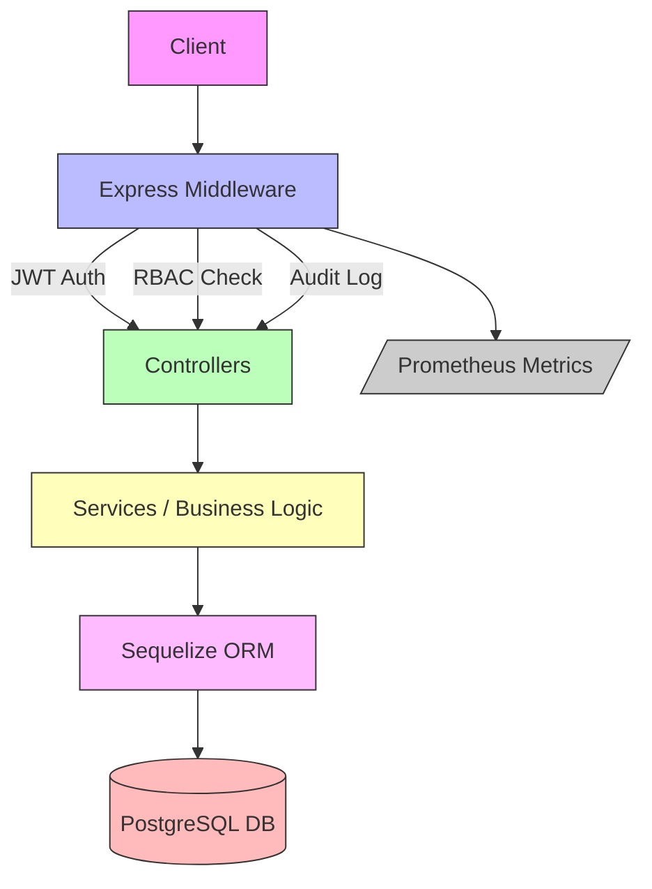

# EMR-Suite Backend Demo

    

**Electronic Medical Records (EMR) Suite – Backend Demo**

> ⚠️ **Note for recruiters:** This repo is a **demo** of a production-grade backend powering the **wiCare EMR system**.
> It demonstrates **authentication, RBAC, audit logging, Swagger docs, metrics, Dockerized workflows, and modular APIs**.
> Frontend integration (Angular/Ionic) is in progress.

---

## 🌟 Key Features

* **Authentication & Security**

  * JWT access + refresh tokens
  * Token revocation & expiry
  * Rate limiting (global & per-route)
  * Helmet + CORS + morgan request logging
* **RBAC (Role-Based Access Control)**

  * Roles: `super_admin`, `admin`, `doctor`, `nurse`, `receptionist`, `patient`
  * Fine-grained permissions (e.g. `appointment.create`, `clinicalnote.read`, `vital.update`)
  * Many-to-many relations (`UserRoles`, `RolePermissions`)
  * Centralized `authorize()` middleware
* **Modules / APIs**

  * **Users & Roles** → CRUD, login, password change
  * **Patients** → CRUD
  * **Appointments** → CRUD
  * **Bills** → CRUD
  * **Clinical Notes** → CRUD
  * **Vitals** → CRUD
* **Audit Logging**

  * Records CRUD + Auth actions
  * Includes `actorId`, `entity`, `before`, `after`
* **Developer Experience**

  * Swagger (`/api-docs`) with RBAC notes
  * Sequelize migrations + seeds
  * Jest + Supertest tests (`appointments`, `clinicalNotes`, `vitals`)
  * Docker (dev + prod) with `entrypoint.sh` waiting for DB
  * Prometheus metrics (`/metrics`) for monitoring
* **Recruiter-Friendly**

  * Modular, scalable, CI/CD-ready
  * Shows ability to handle **real-world infra**

---

## 🏗️ Project Structure

```
emr-suite-backend/
├─ src/
│  ├─ config/               # env, db, swagger, jwt config
│  ├─ constants/            # roles, permissions, status codes
│  ├─ controllers/          # Express handlers
│  ├─ middlewares/          # auth, RBAC, audit, rateLimit, metrics
│  ├─ models/               # Sequelize models
│  ├─ routes/               # API route definitions
│  ├─ seed/                 # seeding logic for roles, users, permissions
│  ├─ utils/                # logger, validators
│  ├─ app.js                # express app setup
│  └─ server.js             # entry point
├─ tests/                   # Jest + Supertest
│  ├─ appointment.test.js
│  ├─ clinicalNote.test.js
│  └─ vital.test.js
├─ docker/
│  ├─ Dockerfile            # multi-stage (production)
│  ├─ Dockerfile.dev        # development image
│  ├─ entrypoint.sh         # waits for DB, runs migrations/seeds, starts server
│  ├─ init.sql              # optional DB bootstrap
│  ├─ docker-compose.dev.yml
│  └─ docker-compose.prod.yml
├─ .env.docker.dev
├─ .env.local.dev
├─ .env.prod
├─ package.json
└─ README.md
```

---

## 🖼️ Architecture Diagram



---

## 🔐 Authentication & RBAC

* **Login:** `POST /api/auth/login`
* **Refresh:** `POST /api/auth/refresh`
* **Logout:** `POST /api/auth/logout`
* **Change password:** `POST /api/auth/change-password`

### Roles & Permissions

* `super_admin` → all modules
* `admin` → admin modules
* `doctor` → clinical notes + vitals
* `nurse` → vitals + patient info
* `receptionist` → appointments + registration
* `patient` → limited self-access

Example middleware usage:

```js
router.post(
  "/",
  authRequired,
  authorize(PERMISSIONS.CLINICALNOTE_CREATE),
  clinicalController.create
);
```

---

## 🌐 API Docs

* Swagger UI: [http://localhost:5000/api-docs](http://localhost:5000/api-docs)
  Includes request/response samples + RBAC notes.

---

## 🧪 Testing

```bash
npm test             # run all tests
npm run test:watch   # watch mode
npm run test:rbac    # RBAC-specific
```

Tests cover **Appointments**, **Clinical Notes**, **Vitals**, with both positive and negative cases.

---

## 🚀 Local Development (no Docker)

### Prereqs

* Node.js ≥ 20
* PostgreSQL ≥ 15
* npm ≥ 9

### Setup

```bash
git clone https://github.com/olubusade/emr-suite-backend.git
cd emr-suite-backend
npm install
cp .env.dev .env
npm run migrate
npm run seed
npm run dev
```

Server runs at: `http://localhost:5000`

---

## 🐳 Docker Development

```bash
# Start app + Postgres in dev mode
npm run docker:up:dev

# Seed roles, users, permissions
npm run docker:seed:dev

# Tear down
npm run docker:down:dev
```

> Uses `entrypoint.sh` to wait for DB readiness → runs migrations + seeds → starts server.

---

## 🏭 Docker Production

```bash
npm run docker:up:prod
npm run docker:seed:prod
npm run docker:down:prod
```

Optimized multi-stage build (slim runtime, prod deps only).

---

## ⚡ CI/CD (GitHub Actions)

* Runs on **push & PR → main**
* Steps:

  1. Spin up Postgres service
  2. Run migrations & seeds
  3. Run Jest test suite
* Guarantees backend stability per commit.

---

## 📊 Monitoring

* **Prometheus metrics:** `/metrics`
  Tracks:

  * Request count & latency
  * Error rates
  * Route-level performance

Ready to hook into **Grafana**.

---

## 📜 License

MIT License © 2025 Busade Adedayo
