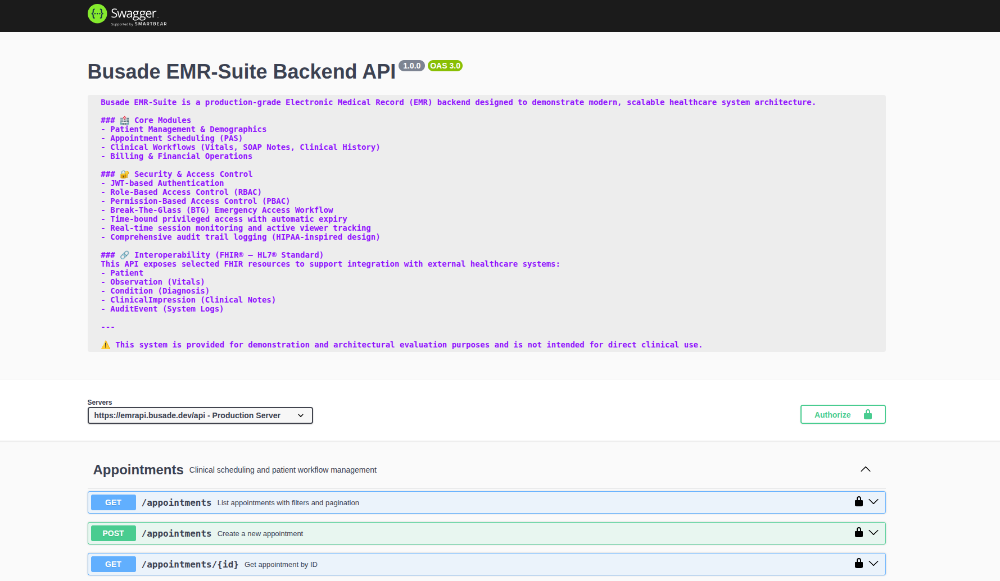
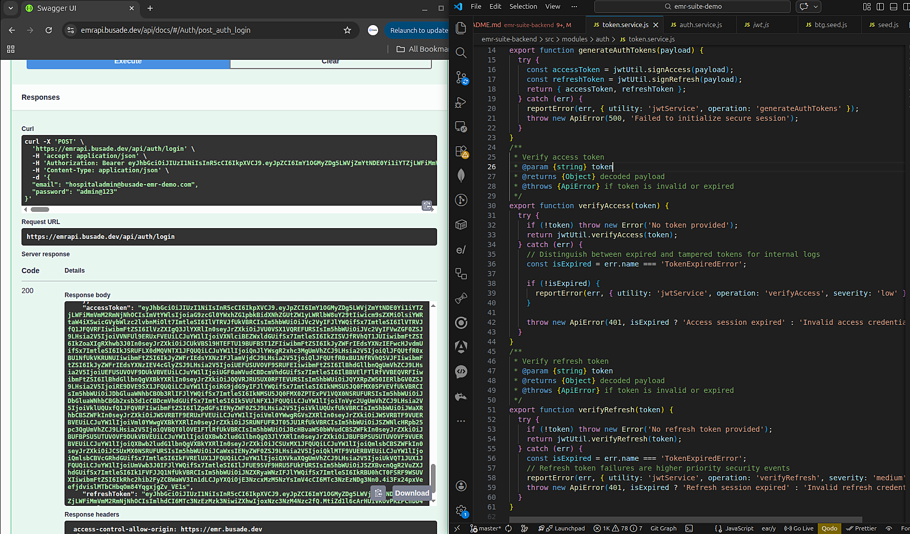
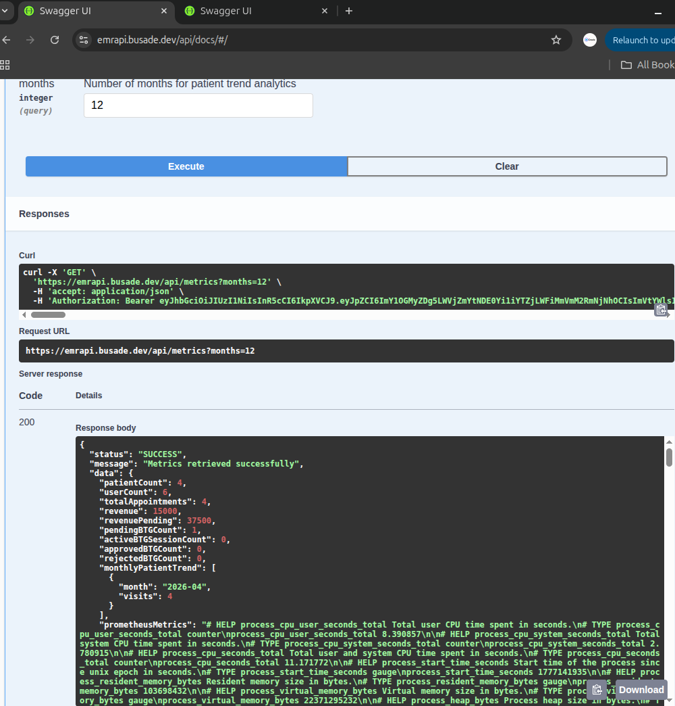
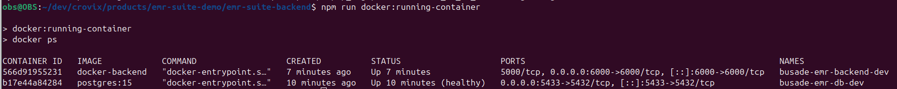
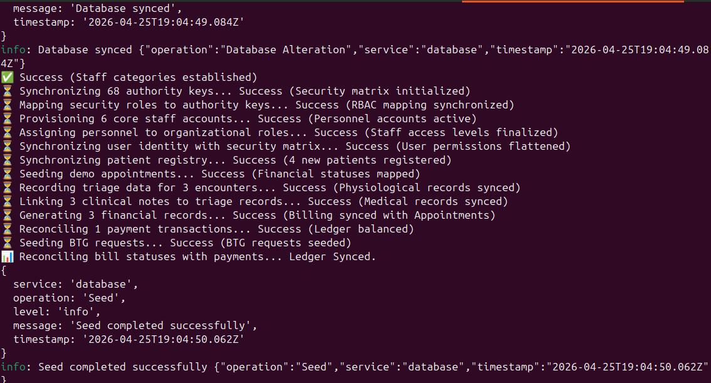
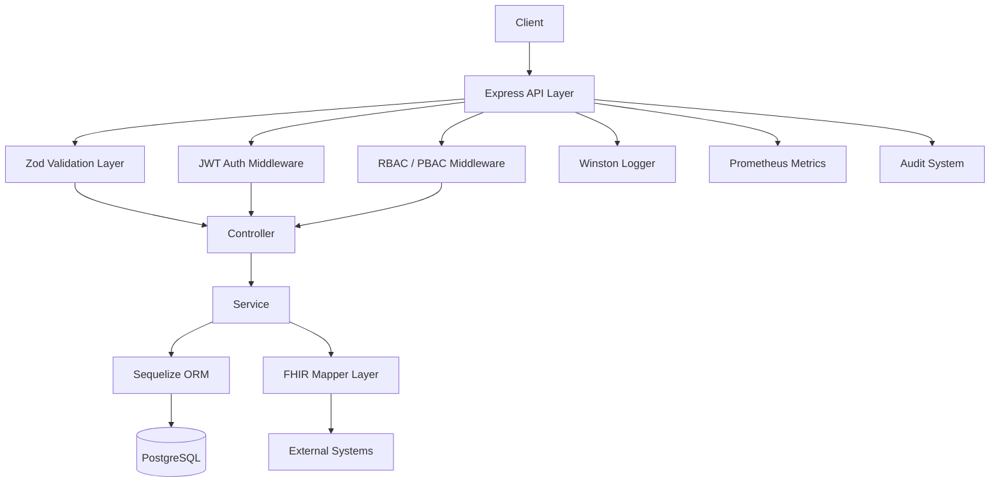
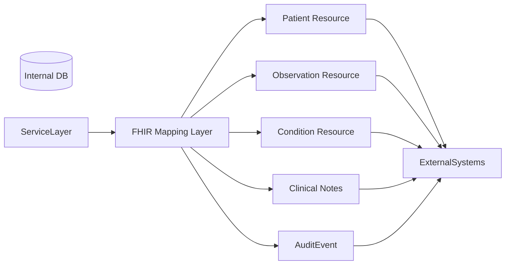

---

# 🏥 EMR-Suite Backend — Enterprise Healthcare System (Flagship Project)


---

## 🎥 System Demo (Full Workflow)

▶️ [https://your-video-link.com](https://your-video-link.com)

**Covers:**

* Authentication (JWT + refresh token flow)
* Role & Permission-based access (RBAC + PBAC)
* Patient lifecycle
* Clinical workflows (SOAP notes, vitals / Triage)
* Billing & invoices
* 🚨 Break-the-Glass (BTG Emergency Access) + Access Tracking
* 🔗 FHIR interoperability endpoints
* Swagger live API testing

---

## 🌍 Live System

* **Backend API:** [https://your-backend.onrender.com/api](https://your-backend.onrender.com/api)
* **Swagger Docs:** [https://your-backend.onrender.com/api/docs](https://your-backend.onrender.com/api/docs)
* **Frontend:** [https://your-frontend.vercel.app](https://your-frontend.vercel.app)

---

## 🧠 SYSTEM OVERVIEW

**EMR-Suite Backend** is a **production-grade Electronic Medical Records (EMR) system** designed using **Domain-Driven Design (DDD)** principles and aligned with **real hospital workflows and healthcare interoperability standards (FHIR R4)**.

It demonstrates how modern healthcare systems are built with:

- **Enterprise-grade security** (JWT, RBAC, PBAC)
- **Auditability & compliance tracking**
- **Metrics, Observability & Monitoring (Prometheus + Winston)**
- **FHIR-based interoperability for clinical data exchange**

---

### 🏥 Core Capabilities

The system simulates real-world hospital operations:

- Patient lifecycle management  
- Appointment scheduling & workflow  
- Clinical documentation (SOAP notes)  
- Vitals & triage tracking  
- Billing & invoice management  
- 🚨 Break-the-Glass (BTG) emergency access control  
- 🔗 FHIR interoperability layer (Patient, Observation, Condition, AuditEvent)  
- Audit & compliance tracking
- Observability & metrics (Prometheus)

> ⚠️ This is not a CRUD demo — it is a **system-level backend architecture** built to reflect real healthcare production environments.

---

## 📸 System Screenshots

> Here are key views from the system

### 1. Swagger API Documentation & Testing Interface (System Overview)

* Shows all endpoints grouped by module
* JWT auth testing
* Validated endpoints (Zod)
* Demonstrates backend completeness


> Full API Surface — Swagger Documentation & Live Testing

### 2. Authentication (Login + JWT Token Flow)
* Login → JWT issued
* Token used in Authorization header
* Permissions embedded in token


> Secure Authentication — JWT + Role & Permission Context

### 3. Patient Module (CRUD + Profile View)
* Patient registration
* Patient list
* Patient profile view
* Core demographic + medical identity
  

> Patient Lifecycle Management

### 4. Appointment System (Workflow)
* Create appointment / update appointment
* Status lifecycle
* Role-aware flows


> Appointment Scheduling & Workflow Management

### 5. Clinical Notes (SOAP) - Create, Read, Update (Doctor View)
* Subjective / Objective / Assessment / Plan
* Doctor-authored
* Immutable history (if finalized)


> Clinical Documentation — Structured SOAP Notes

### 6. Vitals / Triage
* Blood pressure, temperature, SPO2, BMI etc
* Structured observations
* Feeds FHIR Observation


> Vitals Capture — Nurse/Triage Workflow

### 7. Billing & Invoices
* Pending bills
* Paid bills
* Invoice generation / printing


> Billing & Financial Workflow

### 8. Break-the-Glass (BTG)
**Temporary access override**
**Countdown timer**
**Active viewers tracking**
**Full audit logging**


> Emergency Access (Break-the-Glass) with Real-Time Monitoring

### 9. Metrics & Observability Dashboard
* Prometheus metrics endpoint
* Performance counters
* Request tracking & latency
* Error rates
* System health


> System Observability — Metrics & Performance Monitoring

## 10. Docker System Running
* Backend container
* PostgreSQL container
* Startup logs (migrations + seed)


> Containerized Deployment Environment

## 11. Seed log output
* Staff creation
* RBAC mapping
* Patient seeding
* Billing sync



---

# 🏗️ Architecture Philosophy (DDD Modular Design)
The system is structured around **business domains rather than technical layers**, following Domain-Driven Design (DDD).

Key architectural decisions:

- **Domain isolation** — each module owns its business logic  
- **Interoperability-first design** — leveraging FHIR standards  
- **Separation of concerns (SoC)** across validation, services, and infrastructure  
- **Scalable modular structure** aligned with real hospital systems  

### Why this matters:

* Each domain is **independent & scalable**
* Business logic is isolated per module
* Mirrors enterprise hospital systems
* Clean separation of concerns (SoC)

---

# 🏥 Core Healthcare Features

## 🔐 Authentication

* JWT-based auth
* Secure token validation middleware

## RBAC (Role-Based Access Control)

* SUPER ADMIN, ADMIN, RECEPTIONIST, DOCTOR, NURSE
* Who are you?

## PBAC (Permission-Based Access Control)

* Fine-grained permission system
* What are you permitted to do?

## 🧍 Patient Management

* Registration & profile
* Clinical history tracking
* Encounter-based records

## 🩺 Clinical Notes (SOAP Model)

* Subjective / Objective / Assessment / Plan
* Immutable clinical history
* Doctor-authored records

## 💉 Vitals & Observations

* Nurse-driven monitoring
* Structured medical measurements

## 📅 Appointment System

* Scheduling lifecycle
* Role-based views (Doctor/Nurse/Admin)

## 💳 Billing Module

* Invoice generation
* Payment tracking
* Financial audit readiness

## 🚨 Break-The-Glass (BTG)

* Emergency access to restricted records
* Time-bound access sessions
* Live viewer tracking
* Automatic expiry cron job and Audit Log

---

# 🔗 FHIR INTEROPERABILITY LAYER (HL7 STANDARD)

> Enables external systems to integrate with EMR data.

## Supported FHIR Endpoints

```
GET /api/fhir/Patient/:id
GET /api/fhir/Observation?patient=
GET /api/fhir/Condition?patient=
GET /api/fhir/ClinicalNotes?patient=
GET /api/fhir/AuditEvent
```

## FHIR Resources Exposed:

* Patient → demographic & identity
* Observation → vitals & measurements
* Condition → diagnosis
* Composition → clinical SOAP notes
* AuditEvent → system access logs

> Enables interoperability with external hospital systems, insurance platforms, and research tools.

---

# 🏗️ SYSTEM ARCHITECTURE

## 🔁 High-Level Backend Flow


```mermaid
flowchart TD
Client --> API[Express API Layer]

API --> Auth[JWT Auth Middleware]
API --> RBAC[RBAC / PBAC Middleware]
API --> Validate[Zod Validation Layer]

Validate --> Controller
Auth --> Controller
RBAC --> Controller

Controller --> Service
Service --> ORM[Sequelize ORM]
ORM --> DB[(PostgreSQL)]

API --> Logger[Winston Logger]
API --> Metrics[Prometheus Metrics]
API --> Audit[Audit System]

Service --> FHIR[FHIR Mapper Layer]
FHIR --> External[External Systems]
```

---

## 🔗 FHIR INTEROPERABILITY ARCHITECTURE


```mermaid
flowchart LR
EMR_DB[(Internal DB)]
ServiceLayer --> Mapper[FHIR Mapping Layer]

Mapper --> PatientFHIR[Patient Resource]
Mapper --> ObservationFHIR[Observation Resource]
Mapper --> ConditionFHIR[Condition Resource]
Mapper --> CompositionFHIR[Clinical Notes]
Mapper --> AuditFHIR[AuditEvent]

PatientFHIR --> ExternalSystems
ObservationFHIR --> ExternalSystems
ConditionFHIR --> ExternalSystems
CompositionFHIR --> ExternalSystems
AuditFHIR --> ExternalSystems
```

> Enables integration with:

* Insurance platforms
* National health systems
* Research databases
* External EMR systems

---

# 🧩 CORE MODULES (DDD)

```bash
src/
├── modules/          → Business domains (DDD core)
│   ├── patient/           → Patient lifecycle management
│   ├── appointment/       → Scheduling & clinical workflow
│   ├── clinical-notes/    → SOAP-based clinical documentation
│   ├── vitals/           → Nurse-driven observations & triage
│   ├── billing/          → Invoicing & financial management
│   ├── user/             → Staff management & identity
│   ├── audit/            → Compliance & system audit logs
│   ├── btg/              → Break-the-Glass emergency access system

├── fhir/              → Interoperability layer (FHIR R4 compliant APIs)
│                       → Patient, Observation, Condition, AuditEvent, Composition

├── shared/            → Cross-cutting concerns
│                       → Authentication, RBAC/PBAC, validation (Zod), utilities, error handling

├── config/            → Infrastructure configuration
│                       → Database (Sequelize), Swagger setup, logger (Winston), environment config

├── constants/         → System-wide constants
│                       → Roles, permissions, enums, status codes

├── jobs/              → Background processes
│                       → Cron jobs (BTG expiry, session cleanup, scheduled tasks)

├── seed/              → Database bootstrap
│                       → Initial users, roles, permissions, demo hospital data

├── tests/             → Automated testing suite
│                       → Jest + Supertest (unit, integration, RBAC tests)

docker/                → Containerization setup
│                       → Multi-stage  (Dockerfiles, docker-compose, entrypoint scripts)

logs/                  → Application logging layer
│                       → combined.log, error.log, exception tracking, security logs

.env.docker.dev        → Docker development environment configuration
.env.local.dev         → Local development environment configuration
.env.prod              → Production environment configuration

app.js                 → Express application setup (middlewares, routing, security, observability)
server.js             → Application entry point (server bootstrap, port binding, startup logs)
```

---

# 🚨 BREAK-THE-GLASS (BTG) SYSTEM

> Emergency access mechanism for restricted patient data

### Features:

* Time-bound access sessions
* Live viewer tracking
* Countdown expiration
* Auto-expiry via cron job
* Full audit logging

```js
// Auto-expiry job
await BTGRequest.update(
  { status: 'EXPIRED' },
  {
    where: {
      status: 'APPROVED',
      expiresAt: { [Op.lt]: new Date() }
    }
  }
);
```

---

# 🔐 SECURITY ARCHITECTURE

## 1. JWT Authentication Guard (Access Control Layer)
Protects all secured endpoints by validating access tokens.

```js
export function authRequired(req, res, next) {
  const hdr = req.headers.authorization || '';
  const token = hdr.startsWith('Bearer ') ? hdr.slice(7) : null;
  if (!token) return fail(res, 401, 'Authentication required');
  try {
    const payload = verifyAccess(token);
    req.user = payload;
    next();
  } catch {
    return fail(res, 401, 'Invalid or expired token');
  }
}
```
## 🔄 2. Refresh Token Security Layer
Ensures secure session renewal with expiration control.

```js
export const signRefresh = (payload) =>
  jwt.sign(payload, config.jwt.refreshSecret, {
    expiresIn: config.jwt.refreshTtl
  });
```
## 🚨 3. Threat Detection & Security Monitoring
Detects suspicious authentication behavior such as token reuse or session hijacking.

```js
logSecurityAlert('Possible Refresh Token Reuse Attack', {
  userId: payload.id,
  ip
});
```

### 🧠 Security Coverage
**Detects:**
* Token reuse attacks
* Session hijacking attempts
* Replay attacks
* Unauthorized access attempts

---

## 4. RBAC + PBAC (Hybrid Authorization Model)

```js
authorize(PERMISSIONS.CLINICAL_NOTE_READ)
```

* RBAC → defines who you are (Doctor, Nurse, Admin)
* PBAC → defines what you can do (fine-grained permissions)

### 🧠 Role Enforcement Middleware
```js
export const authorize = (permission) => {
  return (req, res, next) => {
    const userPermissions = req.user?.permissions || [];

    if (!userPermissions.includes(permission)) {
      return res.status(403).json({
        status: 'FAIL',
        message: 'Insufficient permissions'
      });
    }

    next();
  };
};
```
### 🏥 Example in FHIR / Clinical Access Layer
```js
router.get(
  '/ClinicalNotes',
  authRequired,
  authorize(PERMISSIONS.CLINICAL_NOTE_READ),
  validate(FHIRClinicalNoteSchema),
  asyncHandler(getClinicalNotesFHIR)
);
```

**✔ Enterprise pipeline design** 👉 Authentication layer → Authorization layer → Validation layer → Business logic layer

## 5. Request Validation & Schema Enforcement (Zod Layer)
All inputs validated at the edge:

```js
validate(FHIRPatientSchema)
```
Purpose:
✔ Prevents invalid or malicious payloads at entry point
✔ Enforces API contracts
✔ Improves system stability

### 🧠 Validation Middleware

```js
export const FHIRClinicalNoteSchema = z.object({
  query: z.object({
    patient: z.string().uuid(),
    dateFrom: z.string().optional(),
    dateTo: z.string().optional()
  })
});
```

## 6. Rate Limiting & API Abuse Protection

```js
app.use(rateLimiter);
app.use('/api/auth/login', authLimiter);
```
### 🛡️ Global Rate Limiter (System-wide protection)
```js
export const rateLimiter = rateLimit({
  windowMs: 15 * 60 * 1000,
  max: 300,
  message: {
    status: 'FAIL',
    message: 'Too many requests, please try again later'
  }
});
```

### 🔐 Strict Auth Endpoint Protection
```js
export const authLimiter = rateLimit({
  windowMs: 10 * 60 * 1000,
  max: 10,
  message: {
    status: 'FAIL',
    message: 'Too many login attempts'
  }
});
```

## 7. Combined Security Pipeline (IMPORTANT INSIGHT)
```js
router.get(
  '/Patient/:id',
  authRequired,
  authorize(PERMISSIONS.PATIENT_READ),
  validate(FHIRPatientSchema),
  asyncHandler(getPatientFHIR)
);
```
---

# 📊 OBSERVABILITY & LOGGING

## Logging Layers (Winston)

* Error logs → `logs/error.log`
* Combined logs → `logs/combined.log`
* HTTP logs → Morgan → Winston

```json
{
  "level": "error",
  "message": "Invalid enum value",
  "userId": "uuid",
  "path": "/api/btg",
  "method": "POST"
}
```

---

## Prometheus Metrics

```bash
GET /metrics
```

Tracks:

* Request latency
* Error rates
* Endpoint performance

---

# 🔗 FHIR API (INTEROPERABILITY)

## Endpoints

```bash
GET /api/fhir/Patient/:id
GET /api/fhir/Observation?patient=
GET /api/fhir/Condition?patient=
GET /api/fhir/ClinicalNotes?patient=
GET /api/fhir/AuditEvent
```

## Example Response

```json
{
  "resourceType": "Bundle",
  "type": "searchset",
  "entry": [...]
}
```

---

# 📚 SWAGGER API DOCUMENTATION

👉 [https://your-backend.onrender.com/api/docs](https://your-backend.onrender.com/api/docs)

### Features:

* JWT authentication testing
* RBAC validation
* Full request/response schemas
* FHIR endpoints documentation

---

# 🐳 DOCKER & DEPLOYMENT

## Development

```bash
npm run docker:up:dev
```

## Production

```bash
npm run docker:up:prod
```

### Includes:

* Multi-stage builds
* DB readiness checks
* Auto migrations + seed
* Environment-based configs

---

# 🔁 CRON JOB SYSTEM

```js
cron.schedule('*/5 * * * *', async () => {
  // expire BTG sessions
});
```

✔ Prevents stale access
✔ Ensures compliance

---

# 🧠 ENGINEERING HIGHLIGHTS

* Domain-Driven Design (DDD)
* FHIR R4 Interoperability
* RBAC + PBAC security model
* Break-the-Glass emergency system
* Real-time viewer tracking
* Prometheus observability
* Winston structured logging
* Swagger-first API design
* Zod schema validation
* Dockerized infrastructure
* Cron-based lifecycle management

---

# 🧪 TESTING STRATEGY

* Jest + Supertest (in progress)
* Swagger as live testing interface
* RBAC negative testing
* Integration-ready structure

---

## 👤 ABOUT THE ENGINEER

**Busade Adedayo**
*Senior Software Engineer / Solution Architect (Healthcare Systems)*

* 5-8+ years of experience building and scaling production-grade **Electronic Medical Record (EMR)** systems
Led architecture and development of domain-driven, modular healthcare platforms used in real clinical workflows
Strong focus on:
✔  Clinical workflow digitization (SOAP notes, vitals, prescriptions)
✔ System architecture & scalability (DDD, modular monolith design)
✔ Healthcare interoperability (FHIR R4 standards)
Security & compliance (RBAC, PBAC, audit logging, BTG - emergency access)
✔ Experienced in designing enterprise backend systems with observability, logging, and monitoring layers
✔ AWS Cloud Practitioner certified | Preparing for AWS Solutions Architect - Associate
✔ **Passionate about building global-standard healthcare infrastructure from Africa for global markets*

---
## 📜 License

MIT © 2026 - Busade Adedayo

---

## 🚀 FINAL NOTE

> This project was intentionally designed to demonstrate how **real-world healthcare systems are engineered, secured, and scaled in production environments** — not just how APIs are built.

It combines **clinical workflow intelligence** with **enterprise-grade software architecture**, including:

* 🧠 Clinical intelligence (SOAP notes, vitals, structured patient records)
* 🚨 Emergency access workflows (Break-the-Glass secure override system)
* 🔗 Healthcare interoperability (FHIR R4 standard integration)
* 🔐 Enterprise security (JWT authentication, RBAC + PBAC, audit logging)
* 📊 Observability & monitoring (Prometheus metrics, Winston structured logs)
* 🧱 Domain-Driven Design (modular architecture aligned to hospital domains)
* 🐳 Production-ready DevOps (Dockerized environment with DB readiness checks)
* 🧪 Testing infrastructure (Jest + Supertest + API validation via Swagger)

---

> **Engineering philosophy:**
> "I don't just build APIs - I design systems that behave like real hospitals under production constraints."

---