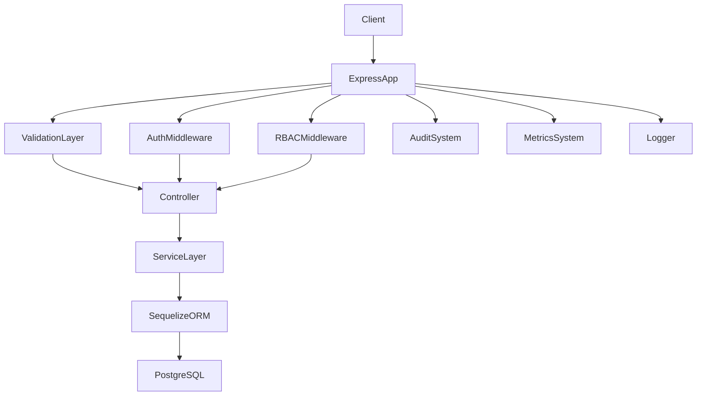

---

# 🏥 EMR-Suite Backend (Flagship Healthcare System)


---
## 🎥 Live System Demo (Quick Walkthrough)

> A short walkthrough showing authentication, appointment flow, billing, and clinical records.

▶️ https://your-video-link.com

---

## 🌍 Live Demo Links

> These links give you an access to the project demo.

* **Backend API (Production):** [https://your-backend.onrender.com/api](https://your-backend.onrender.com/api)
* **Swagger UI (Live Testing & API Docs):** [https://your-backend.onrender.com/api/docs](https://your-backend.onrender.com/api/docs)
* 🌐**Frontend (Angular):** [https://your-frontend.vercel.app](https://your-frontend.vercel.app)

---
## ⚠️ Live Demo Note

> The backend is hosted on Render Free Tier.
> It may take up to 30 seconds to respond on first request due to cold start.

To test immediately:
- Open Swagger UI - https://your-backend.onrender.com/api/docs
- Use `/api/health` endpoint first - https://your-backend.onrender.com/api/health
  
---
## 📸 System Screenshots

> Here are key views from the system

### 1. Swagger API Documentation & Testing Interface (System Overview)
* Shows all endpoints grouped by module


### 2. Authentication (Login + JWT Token Flow)
* Login request
* JWT returned
* Authorization header usage


### 3. Patient Module (CRUD + Profile View)
* Patient registration
* Patient list
* Patient detail view


### 4. Appointment System (Workflow)
* Create appointment
* Update appointment


### 5. Clinical Notes - Create, Read, Update (Doctor View)
* Create note
* Read note
* Update restriction (if finalized)


### 6. Billing & Payments Module (Receptionist & Admin only)
* Pending bills
* Paid bills
* Invoice breakdown


### 7. Metrics & Observability Dashboard
* Prometheus metrics endpoint
* Performance counters
* Request tracking


---
## 8. Docker System Running
* Backend container
* PostgreSQL container
* Logs showing startup + seed success


## 9. Seed log output
* Staff creation
* RBAC mapping
* Patient seeding
* Billing sync


---

## 📌 Overview

**EMR-Suite Backend** is a **production-grade**, domain-driven Electronic Medical Records (EMR) system designed using **DDD (Domain Driven Design)** principles.

It implements real hospital workflows including:

* Patient management
* Appointment lifecycle
* Clinical documentation
* Vitals tracking (Triage)
* Billing
* Audit & compliance tracking
* Metrics & observability

> ⚠️ **This is not a CRUD API demo**
> It is a **system-level backend architecture** built to reflect real healthcare production systems and with **enterprise-level security and compliance in mind**.
---

## 🧠 Architecture Philosophy (DDD-Based Design)
> This system is structured around **business domains, not technical layers**.

```
src/
├── modules/        → Business domains (Appointment, Patient, Billing…)
├── shared/         → Cross-cutting concerns (auth, utils, validators)
├── config/         → Infrastructure setup (DB, JWT, Swagger)
├── constants/      → Roles, permissions, enums
├── seed/           → System bootstrap data
├── docker/         → Containerization
├── tests/
```

### Why this matters:

* Each module is **self-contained**
* Clear Separation of Concern - **(SoC)** i.e. Controllers, services, models are co-located
* Easy scaling per domain
* Mirrors enterprise backend architecture patterns

---

## 🏗️ System Architecture Flow


```mermaid
flowchart TD
Client --> ExpressApp
ExpressApp --> AuthMiddleware
ExpressApp --> RBACMiddleware
ExpressApp --> ValidationLayer
ValidationLayer --> Controller
AuthMiddleware --> Controller
RBACMiddleware --> Controller
Controller --> ServiceLayer
ServiceLayer --> SequelizeORM
SequelizeORM --> PostgreSQL

ExpressApp --> AuditSystem
ExpressApp --> MetricsSystem
ExpressApp --> Logger
```

---

## 🧠 Key Engineering Highlights & Tools Used

### 1. Production Docker Setup with Database Readiness (Top-Notch DevOps)
* Uses multi-stage Docker + intelligent entrypoint with pg_isready.
```From docker/entrypoint.sh:```
```js 
sh#!/bin/sh
set -e

# DATABASE READINESS CHECK (prevents crash during Postgres init)
if [ -n "$DB_HOST" ] && [ "$DB_HOST" != "localhost" ]; then
  echo "[entrypoint] Waiting for database..."
  until pg_isready -h "$$   DB_HOST" -p "   $${DB_PORT:-5432}" -U "${DB_USER:-postgres}" >/dev/null 2>&1; do
    echo "[entrypoint] Database not ready, retrying..."
    sleep 2
  done
fi

# Auto-run migrations and seeders
npm run migrate
npm run seed

exec npm run start
```
> Dockerfiles:**Dockerfile** (multi-stage with deps/runtime separation) and **Dockerfile.dev** (hot-reload with nodemon).

---
### 🔐 2. Advanced RBAC & Permission System (Role & Permission-Based Access Control)

* Fine-grained permission system
* Not role-based only — **permission-driven authorization**
* Used across routes for secure, role-aware access.
* Example:

```js
const authorize = (requiredPermission) => {
  return (req, res, next) => {
    if (!req.user.permissions?.includes(requiredPermission)) {
      return res.status(403).json({ message: 'Forbidden: Insufficient permissions' });
    }
    next();
  };
}
```
---
### 3. Edge Validation & Enum Safety (Zod-style patterns)
* Prevents invalid data early (fixed issues like MARITAL_ENUM.includes is not a function seen in logs).
* From **shared/validators/patient.validator.js**
```js 
JavaScriptconst validatePatientEnums = (data) => {
  if (data.maritalStatus && !MARITAL_ENUM.includes(data.maritalStatus)) {
    throw new Error('Invalid marital status value');
  }
  // Additional strict enum & schema checks
};
```
---
### 4. Structured Audit Logging System with Winston (Healthcare-grade)

* Every sensitive mutation is tracked:
* Production-grade JSON logging with context.

* Actor ID
* Before/After state
* Entity affected
* Timestamp
* Action type

* Structured log from (logs/error.log & combined.log)
```js
{
  "level": "error",
  "message": "column Appointment.type does not exist",
  "timestamp": "2026-04-16T10:58:11.957Z",
  "userId": "1b325fee-937a-4423-b0e3-bb525657a636",
  "path": "/api/metrics",
  "method": "GET"
}
```
> This mirrors real-world **clinical compliance requirements (HIPAA-like auditability)**

---

### 5. Schema-first Validation (Zod)

> All requests are validated at the edge:

```js
export const updateAppointmentSchema = z.object({
  body: z.object({
    appointmentDate: isoDateString().optional(),
    status: APPOINTMENT_STATUS_ENUM.optional()
  })
});
```
---

### 📊 6. Observability Layer with Prometheus

* Prometheus metrics (`/metrics`)
* Winston structured logging
* Request latency tracking
* Error rate monitoring
* Uses **prom-client** for custom counters (request latency, error rates, route performance).
* Exposed at **/metrics**.

---

### 🔁 7. Async Safety Layer

* Centralized async handler
* Prevent unhandled promise rejections
* From **shared/utils/asyncHandler.js**:

```js
export const asyncHandler = (fn) => (req, res, next) =>{
  Promise.resolve(fn(req, res, next)).catch(next);
}
```

---

## 🚨 Error Handling & Resilience Strategy

> This system implements a centralized, production-grade error handling architecture designed for predictability, observability, and frontend stability.

---

**🧠 Philosophy**

> Errors are classified into two categories:

**1.** Operational Errors (Expected) → Handled with ApiError
**2.** System Errors (Unexpected) → Logged + safely masked

---

## 🧩 Custom Error Class (ApiError) 
```js
export default class ApiError extends Error {
  constructor(statusCode, message) {
    super(message);
    this.statusCode = statusCode;
    this.isOperational = true;
  }
}
```
---
## ⚙️ Usage in Services (Real Example)

**From appointment.service.js:**
```js
if (Number.isNaN(when.getTime())) {
  throw new ApiError(400, 'Invalid appointmentDate');
}

if (when < new Date(new Date().setHours(0,0,0,0))) {
  throw new ApiError(400, 'appointmentDate cannot be in the past');
}

// Prevent double booking
if (existing) {
  throw new ApiError(409, 'Time slot already booked');
}
```

---
## 📚 Standard Error Types Used
**Status Code	Type	Usage**
* 400	Bad Request	Validation & business rules
* 401	Unauthorized	Missing/invalid JWT
* 403	Forbidden	RBAC permission failure
* 404	Not Found	Missing resource
* 409	Conflict	Duplicate records
* 500	Internal Error	Unexpected failures

---
## 🔁 Error Flow (End-to-End)
Controller → Service → throws ApiError
                    ↓
          Global Error Handler
                    ↓
        Standard JSON API Response
---

## 📦 Standard API Error Response
```js
{
  "status": "ERROR",
  "message": "appointmentDate cannot be in the past"
}
```
---
## 🛡️ Global Error Handling Layer
All errors are intercepted centrally:
---

```js
app.use((err, req, res, next) => {
  reportError(err, {
    path: req.path,
    method: req.method,
    userId: req.user?.id
  });

  if (err instanceof ApiError) {
    return res.status(err.statusCode).json({
      status: 'ERROR',
      message: err.message
    });
  }

  return res.status(500).json({
    status: 'ERROR',
    message: 'Internal Server Error'
  });
});
```
---

## 📊 Observability Integration

All errors are:

* Logged via Winston
* Tracked with contextual metadata
* Ready for Elasticsearch Logstash Kibana (ELK) / Loki / Datadog integration (Paid SaaS monitoring tool).

---

```js
{
  "level": "error",
  "message": "appointmentDate cannot be in the past",
  "userId": "acaba7ca-61d4...",
  "path": "/api/appointments",
  "method": "POST"
}
```
---

## 🎯 Why This Matters

This approach ensures:

✔ Consistent API responses for frontend
✔ No sensitive error leakage
✔ Easy debugging in production
✔ Clear separation of concerns
✔ Healthcare-grade auditability

---

## 🛡️ Security Event Monitoring (Refresh Token Protection)

The system includes proactive detection of suspicious authentication behavior.

```js
logSecurityAlert('Possible Refresh Token Reuse Attack', {
  userId: payload.id,
  ip
});
```

---

## 🔍 What it detects
* Reuse of invalidated refresh tokens
* Potential token theft
* Session replay attempts

---

## 🧠 Security response strategy
Event is logged with full context (userId, IP address)
Refresh flow is blocked
System maintains audit trail for investigation

---

## 🧩 Domain Modules (DDD CORE)

### 🧍 Patient Module

* Registration
* Demographics
* Medical identity

### 📅 Appointment Module

* Scheduling
* Status Lifecycle 
* Role-aware views - Doctor/Nurse scheduling flow

### 🩺 Clinical Notes Module

* Doctor-only access
* Immutable clinical history with full audit trail

### 💉 Vitals Module

* Nurse-driven inputs
* Structured medical measurements

### 💳 Billing Module

* Invoice generation
* Payment tracking
* Revenue audit readiness

### 📊 Metrics Module

* Aggregated hospital KPIs using Sequelize complex queries
* Patient trends
* Operational insights

### 👤 User Module

* Staff management
* Role assignment
* Profile lifecycle

### Audit Module
* Compliance logging

---

## 🧪 Swagger API Testing (LIVE SYSTEM FEATURE)

> This project is fully testable via Swagger:
**Swagger UI - Live Testing**
👉 **Swagger UI (Live Testing & API Docs) direclty in the browser:** [https://your-backend.onrender.com/api/docs](https://your-backend.onrender.com/api/docs)

### Includes:

* Live request execution
* JWT authentication testing
* RBAC enforcement validation
* Schema-based request validation
* Real database interaction

---

## 🧪 Testing Strategy

* Jest + Supertest suite ready in **/tests**
* Integration tests across modules will run agains real PostgreSQL
* RBAC negative testing
* Authentication validation tests
* **NB:**Swagger currently serves as the primary live testing interface

```bash
npm test   # (will be full active soon)
```

---

## 🚀 Deployment Architecture

### Backend (Render)

* Node.js service
* PostgreSQL database
* Auto CI/CD deployment

### Frontend (Vercel)

* Angular/Ionic SPA
* API-connected to backend

---

## 📁 Project Structure (DDD IMPLEMENTATION)

```bash
docker/
logs/
src/
├── config/
├── constants/
├── modules/
│   ├── appointment/
│   ├── patient/
│   ├── clinical-note/
│   ├── vital/
│   ├── billing/
│   ├── metrics/
│   ├── user/
│   └── audit/
├── shared/
│   ├── middlewares/
│   ├── validators/
│   ├── utils/
│   └── constants/
├── seed/
├── tests/
├── .env.docker.dev
├── .env.local.dev
├── .env.prod
├── app.js
└── server.js
```

---

### 🐳 Docker, DevOps & Infrastructure

* Dockerized environment (dev + prod) - **docker-compose.dev.yml** + **docker-compose.prod.yml**
* Multi-stage builds for optimized images
* Seed automation via **init.sql**
* CI pipeline (GitHub Actions)
* Environment-based config system

---
## 🐳 Docker Execution & Meaning of Scripts

> This project uses Docker to ensure environment parity across development, testing, and production.

### ⚙️ Core Idea

> Instead of running Node.js manually, the system runs:

**Docker → Node App → PostgreSQL → Migrations → Seed → API Ready**

## 📦 Docker Scripts Explained
# 🟢 Development Stack

1. Start Full Dev Environment
```js  
  npm run docker:up:dev
```
**What it does:**

> Runs the entire backend stack in development mode.

Internally executes:

```js
docker compose -f docker/docker-compose.dev.yml --env-file .env.docker.dev up --build -d
npm run docker:migrate:dev
npm run docker:seed:dev
```

**Meaning:**
**Step	                Description**
* up --build -d	--      Builds and starts containers in background
* migrate	              Runs Sequelize DB migrations
* seed	                Populates dev database with demo data

2. Run Migrations Only
```js
npm run docker:migrate:dev
```

**Meaning:**
* Spins up backend container
* Executes:
```js
sequelize db:migrate
```
* Ensures DB schema is up to date
  
3. Run Seeders Only
```js
npm run docker:seed:dev
```
**Meaning:**
> Injects:
    - Staff accounts
    - Patients
    - Appointments
    - Clinical notes
    - Bills
    - Payments
  
4. Stop Dev Environment
```js
npm run docker:down:dev
```
**Meaning:**
> Stops and removes all containers for dev stack.

5. Clean Orphan Containers
```js
npm run docker:remove-orphans:dev
```
**Meaning:**
> Removes leftover Docker containers from previous builds.

6. View Logs
```js
npm run docker:logs:dev
```
**Meaning:**
> Streams real-time logs from backend container:

* API requests
* Errors
* DB logs
* Seed logs
---
  
# 🟣 Production Stack

7. Start Production Stack
```js
npm run docker:up:prod
```
**Meaning:**
> Runs production-ready backend:

**build → start → migrate → seed**
8. Production Migrations
```js
npm run docker:migrate:prod
```
**Meaning:**
> Applies schema changes safely in production DB.

9. Production Seeder
```js
npm run docker:seed:prod
```
**Meaning:**
> Seeds production-safe baseline data (if enabled).

10. Stop Production Stack
```js
npm run docker:down:prod
```

11.  Production Logs
```js
npm run docker:logs:prod
```
---

# 🧠 Why This Docker Setup is Strong
* Ensures zero manual setup
* Fully reproducible environments
* CI/CD compatible
* Prevents **works on my machine**
* Matches real enterprise deployment pipelines

---

## 🔁 CI/CD Pipeline

> Every push triggers:

1. PostgreSQL spin-up
2. Migration execution
3. Seed execution
4. Jest test suite
5. Build validation

---

## 👤 About the Engineer

**Busade Adedayo**
**Solution Architect & Senior Software Engineer** (Healthcare Systems)

* 8+ years of professional software engineering experience, including **4+ years full-time** building and maintaining production Electronic Medical Records (EMR) systems and **3+ years** as a consultant to a leading EMR solutions provider.
* Strong focus on scalable **enterprise solution architecture**, clinical workflow optimization, auditability, and production reliability.
* Experience with hospital-grade workflows
* AWS Cloud Practitioner certified and currently preparing for the **AWS Solutions Architect Associate** certification.
* Broad experience across backend systems, cloud architecture, and enterprise software solutions.

---

## 📜 License

MIT © 2026 — Busade Adedayo

---

## 🚀 Final Note

> This system was intentionally designed to demonstrate:

> **“How I think in real production healthcare systems — not just how I build APIs.”**

> It combines **strong architectural decisions** (DDD modular structure, intelligent Docker entrypoint, granular RBAC) with **production-grade tooling**:

- Sequelize for complex ORM queries
- Winston for structured logging
- Prometheus for observability
- Docker with database readiness checks
- Comprehensive testing infrastructure (Jest + Supertest + Swagger)

Explore the live Swagger UI and test the system yourself.
---
