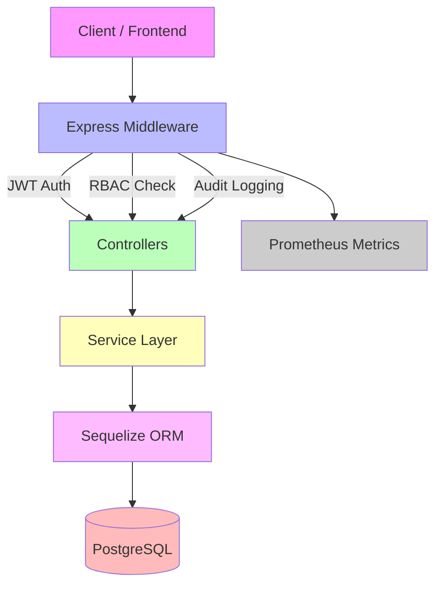

# 🏥 EMR-Suite Backend

**Production-Grade Electronic Medical Records (EMR) Backend (Demo)**
\dd


---

## 📌 Overview

**EMR-Suite Backend** is a **production-grade Node.js backend** designed to power a modern **Electronic Medical Records (EMR)** platform.

> ⚠️ **Recruiter / Reviewer Note**
> This repository is a **backend demo extracted from a real EMR system** (wiCare EMR).
> It intentionally focuses on **architecture, security, scalability, and healthcare workflows**, not UI polish.
> The frontend (Angular + Ionic) lives in a separate repository.

This project demonstrates how I design **secure, auditable, role-aware APIs** suitable for **regulated healthcare environments**.

---

## 🎯 What This Project Demonstrates

✔ Clean backend architecture
✔ Secure authentication & authorization
✔ Real-world healthcare workflows
✔ Auditability & compliance thinking
✔ Production readiness (Docker, CI, tests, monitoring)

This is **not** a CRUD demo — it is a **system-level backend**.

---

## 🧠 Core Architectural Principles

* **Security-first design** (JWT, RBAC, rate limits)
* **Explicit role & permission modeling**
* **Auditability for healthcare compliance**
* **Separation of concerns** (controllers, services, middleware)
* **Observable & testable** by default
* **Container-ready** for modern deployments

---

## 🛠️ The "Senior Engineer" Stack
* **Runtime:** Node.js 20.x (LTS)
* **Data:** PostgreSQL 15 + Sequelize ORM
* **Validation:** Zod (Schema-first request validation)
* **Security:** JWT (Access/Refresh), Argon2/Bcrypt, Helmet, Rate-Limiting
* **DevOps:** Docker (Multi-stage), GitHub Actions CI/CD, Prometheus
* **Testing:** Jest + Supertest (Integration & RBAC Audit Testing)

---

## 🧾 Healthcare Compliance & Auditing
In a real EMR, "Who changed what" is a legal requirement. 
* **Immutable Logs:** The system implements an Audit Service that captures the `before` and `after` state of sensitive records.
* **Actor Tracking:** Every mutation is tied to a specific User ID and Timestamp, providing a 100% transparent history for Clinical Notes and Billing records.

---
## 📊 Observability (Prometheus & Winston)
Built for the "Day 2" of production.
* **Metrics:** Custom Prometheus counters track API latency and 4xx/5xx error rates.
* **Structured Logging:** Winston is configured with transport layers to ensure logs are searchable and follow a standard JSON format for ELK/Loki integration.

---

## 🔐 Authentication & Security

### Authentication

* JWT **access & refresh tokens**
* Token expiration & revocation
* Secure password hashing
* Password change enforcement

### Security Hardening

* Rate limiting (global + route-level)
* Helmet security headers
* CORS configuration
* Centralized request logging

---

## 🔐 Advanced RBAC & Security Logic
Most demos stop at "User vs Admin." This system implements a **Many-to-Many Permission Matrix**:
* **Authorize Middleware:** A custom-built higher-order function that validates specific permissions (e.g., `CLINICAL_NOTE_EDIT`) rather than just checking a role name.
* **Zod Integration:** Every request is validated against a strict schema before hitting the controller, preventing injection and malformed data at the edge.

---

## 🧩 Role-Based Access Control (RBAC)

RBAC is **first-class**, not an afterthought.

### Roles

* `super_admin`
* `admin`
* `doctor`
* `nurse`
* `receptionist`
* `patient`

### Permission Model

* Fine-grained permissions (e.g. `appointment.create`, `vital.update`)
* Many-to-many relationships:

  * `Users ↔ Roles`
  * `Roles ↔ Permissions`
* Centralized `authorize()` middleware

```ts
router.post(
  '/',
  authRequired,
  authorize(PERMISSIONS.CLINICALNOTE_CREATE),
  clinicalController.create
);
```

✔ Easily extensible
✔ Prevents role leakage
✔ Matches enterprise RBAC standards

---

## 🏥 Domain Modules

Each module mirrors **real hospital workflows**:

### 🧍 Patients

* Registration & demographic management
* Medical identifiers
* Emergency contacts

### 📅 Appointments

* Reception-driven scheduling
* Status lifecycle (today / past / upcoming)
* Role-aware visibility

### 🩺 Clinical Notes

* Doctor-only creation
* Immutable historical records
* Full audit trail

### 💉 Vitals

* Nurse-driven vitals capture
* Time-series friendly design

### 💳 Billing

* Paid vs pending bills
* Financial audit readiness

---

## 🧾 Audit Logging

Every sensitive action is recorded.

**Audit captures:**

* Actor (who performed the action)
* Entity affected
* Action type
* Before & after state
* Timestamp

This is critical for:

* Healthcare compliance
* Internal investigations
* Debugging production incidents

---

## 📊 Monitoring & Observability

* **Prometheus metrics** exposed at `/metrics`
* Tracks:

  * Request count
  * Latency
  * Error rates
  * Route-level performance

Ready for **Grafana integration**.

---

## 📐 System Architecture


```mermaid
flowchart TD
    A[Client / Frontend] --> B[Express Middleware]
    B -->|JWT Auth| C[Controllers]
    B -->|RBAC Check| C
    B -->|Audit Logging| C
    C --> D[Service Layer]
    D --> E[Sequelize ORM]
    E --> F[(PostgreSQL)]
    B --> G[Prometheus Metrics]

    style A fill:#f9f
    style B fill:#bbf
    style C fill:#bfb
    style D fill:#ffb
    style E fill:#fbf
    style F fill:#fbb
    style G fill:#ccc
```

---
🚀 Deployment
Zero-Cost Demo (Render)
For demo purposes, this backend is configured for Render.

Connect this GitHub repo to Render.

Add DATABASE_URL and JWT_SECRET to environment variables.

The render.yaml (Blueprint) will automatically provision the Web Service and Database.

## 📁 Project Structure

```bash
emr-suite-backend/
├── src/
│   ├── config/          # env, db, jwt, swagger
│   ├── constants/       # roles, permissions, enums
│   ├── controllers/    # HTTP layer
│   ├── middlewares/    # auth, RBAC, audit, rateLimit
│   ├── models/         # Sequelize models
│   ├── routes/         # API definitions
│   ├── seed/           # roles, users, permissions
│   ├── services/       # SQL logic
│   ├── utils/          # logger, validators
│   ├── app.js
│   └── server.js
├── tests/              # Jest + Supertest
├── docker/             # Docker & compose configs
├── .env.*              # Environment configs
└── README.md
```

---

## 📚 API Documentation

* **Swagger UI:**
  👉 `http://localhost:5000/api-docs`

Includes:

* Request/response schemas
* Auth requirements
* RBAC notes per endpoint

---

## 🧪 Testing Strategy

* **Jest + Supertest**
* Covers:

  * Appointments
  * Clinical Notes
  * Vitals
  * RBAC enforcement
* Includes negative cases (permission denied, invalid input)

```bash
npm test
npm run test:watch
```

---

## 🚀 Local Development

### Prerequisites

* Node.js ≥ 20
* PostgreSQL ≥ 15
* npm ≥ 9

```bash
git clone https://github.com/olubusade/emr-suite-backend.git
cd emr-suite-backend
npm install
cp .env.local.dev .env
npm run migrate
npm run seed
npm run dev
```

Server: `http://localhost:5000`

---

## 🐳 Docker Support

### Development

```bash
npm run docker:up:dev
npm run docker:seed:dev
```

### Production

```bash
npm run docker:up:prod
npm run docker:seed:prod
```

Multi-stage builds ensure:

* Small image size
* Faster deployments
* Production-only dependencies

---

## 🔁 CI/CD (GitHub Actions)

* Runs on every **push & PR**
* Pipeline:

  1. Spin up PostgreSQL
  2. Run migrations & seeds
  3. Execute Jest test suite

✔ Prevents broken deployments
✔ Enforces discipline

---

## 👤 About the Author

**Busade Adedayo**
Senior Software Engineer (Healthcare Systems)

* 5+ years building production EMR systems
* Strong focus on backend architecture & security
* Experience with real hospital workflows
* Passionate about scalable, maintainable systems

---

## 📜 License

MIT © 2025 — Busade Adedayo

---